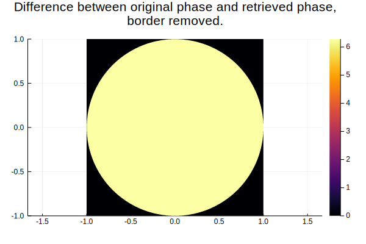
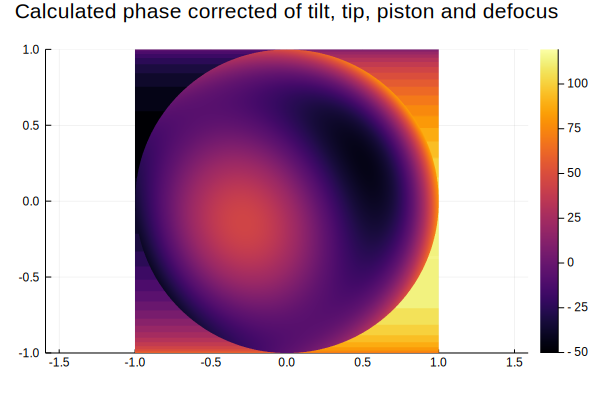

# Example of using Wavefronts.jl


```julia
using Plots
using Wavefronts
```

    ┌ Info: Recompiling stale cache file /home/klafyvel/.julia/compiled/v1.2/Wavefronts/NyKHD.ji for Wavefronts [5a5f1f2e-54ce-422a-b05d-abd9e7c2d134]
    └ @ Base loading.jl:1240


## Making interference patterns

Let's model a phase stepping interferometer. We need four patterns with a reference shifted by π/2 every time.


```julia
x = -1:0.001:1
y = -1:0.001:1
X = repeat(reshape(x, 1, :), length(y), 1)
Y = repeat(y, 1, length(x))
evaluate_intensity(f) = map(f, X, Y)
a = Wavefront(
    Tilt(10)+Coma(10,20)+Spherical(10)+Defocus(10),
    circ
)
patterns = [
    map(intensity(a, Wavefront(Tip(30)+Piston(i*π/2), circ)), X, Y)
    for i in 0:3
];
```

The patterns are like this


```julia
heatmap(x,y,patterns[1],aspect_ratio=1,title="Interference patterns")
```


## Retrieving the phase step by step

Let's retrieve the raw phase


```julia
raw = rawphase(patterns...)
heatmap(x,y,raw, aspect_ratio=1, title="Raw phase")
```


```julia
unwrapped = unwrapphase(raw)
heatmap(x,y,unwrapped, aspect_ratio=1, title="Unwrapped phase")
```


The reference was tilted, let's remove it by hand (there is also a function which does it for you).


```julia
ref_ϕ = phase(Wavefront(Tip(30)))
```


    #1 (generic function with 1 method)


```julia
ref_ϕ_values = ref_ϕ.(X,Y)
calc_phase = unwrapped + ref_ϕ_values
heatmap(x,y,calc_phase, aspect_ratio=1, title="Unwrapped phase, reference removed")
```


```julia
original_values = phase(a).(X,Y)
diff = abs.(original_values - calc_phase)
heatmap(x,y,diff, aspect_ratio=1, title="Difference between original phase and calculated phase")
```


It is expected that the border presents weird behaviour. We can ignore that.


```julia
diff .*= circ.(X,Y)
heatmap(x,y,diff, aspect_ratio=1, title="Difference between original phase and retrieved phase, \nborder removed.")
```





We can calculate the RMS of the difference


```julia
rms = sqrt(sum(diff.^2) / sum(circ.(X,Y)))
```


    6.2831853071795845


weird, it looks like the phase shift is constant


```julia
2π - rms
```


    1.7763568394002505e-15


Yeah, so obviously it's only an ambiguity over 2π, which makes sens. We can re-evaluate the RMS knowing that


```julia
diff = circ.(X,Y) .* (diff.-2π)
rms = sqrt(sum(diff.^2) / sum(circ.(X,Y)))
```


    4.1568208770299665e-15


Better :D


```julia
heatmap(x,y,diff, aspect_ratio=1, title="Difference between original phase and retrieved phase, \nborder and 2pi ambiguity removed.")
```


Okay, let's try to find the aberrations in this.


```julia
project(Tilt, calc_phase, mask=circ)
```


    Tilt(9.998483428521132)


Coool :D, as a reminder, the original aberration was


```julia
Tilt(10)+Coma(10,20)+Spherical(10)+Defocus(10)
```


    Wavefronts.AddAberration(Wavefronts.AddAberration(Wavefronts.AddAberration(Tilt(10), Coma(Wavefronts.HorizontalComa(10), Wavefronts.VerticalComa(20))), Spherical(10)), Defocus(10))


Let's find other aberrations !


```julia
project(Tip, calc_phase, mask=circ)
```


    Tip(-0.0006443144242641213)


```julia
project(Coma, calc_phase, mask=circ)
```


    Coma(Wavefronts.HorizontalComa(9.999317746440996), Wavefronts.VerticalComa(19.997991178457728))


```julia
project(Piston, calc_phase, mask=circ)
```


    Piston(-6.284089170735127)


Oh, here is our $2\pi$ error again !


```julia
project(Defocus, calc_phase, mask=circ)
```


    Defocus(9.9989115973913)


```julia
project(Astigmatism, calc_phase, mask=circ)
```


    Astigmatism(Wavefronts.ObliqueAstigmatism(-8.893678329211982e-16), Wavefronts.VerticalAstigmatism(-5.929118886141322e-16))


```julia
project(Trefoil, calc_phase, mask=circ)
```


    Trefoil(Wavefronts.ObliqueTrefoil(-0.001149438351092385), Wavefronts.VerticalTrefoil(0.0031118694231453787))


```julia
project(Spherical, calc_phase, mask=circ)
```


    Spherical(9.998530646137448)


We can even correct some aberrations !


```julia
corrected = correct(Tilt, calc_phase,mask=circ)
heatmap(x,y,corrected, aspect_ratio=1, title="Calculated phase corrected of tilt")
```


## Automated method

Of course, in real life you don't want to do all these steps by yourself and it's perfectly fine because Wavefronts.jl does them for you. :)


```julia
calc_phase = retrievephase(patterns...; mask=circ, correct_aberrations=[Tilt, Tip, Piston, Defocus])
heatmap(x,y,calc_phase, aspect_ratio=1, title="Calculated phase corrected of tilt, tip, piston and defocus")
```





Our calculated phase still have the interesting aberrations (coma and spherical) while the others have been removed. As a reminder the original aberrations were `Tilt(10)+Coma(10,20)+Spherical(10)+Defocus(10)`.


```julia
project(Tilt, calc_phase, mask=circ), project(Coma, calc_phase, mask=circ), 
project(Spherical, calc_phase, mask=circ), project(Defocus, calc_phase, mask=circ)
```


    (Tilt(0.00022790806120813725), Coma(Wavefronts.HorizontalComa(9.999317748986906), Wavefronts.VerticalComa(19.998635395167106)), Spherical(9.99909178844765), Defocus(0.0004552520838158169))


